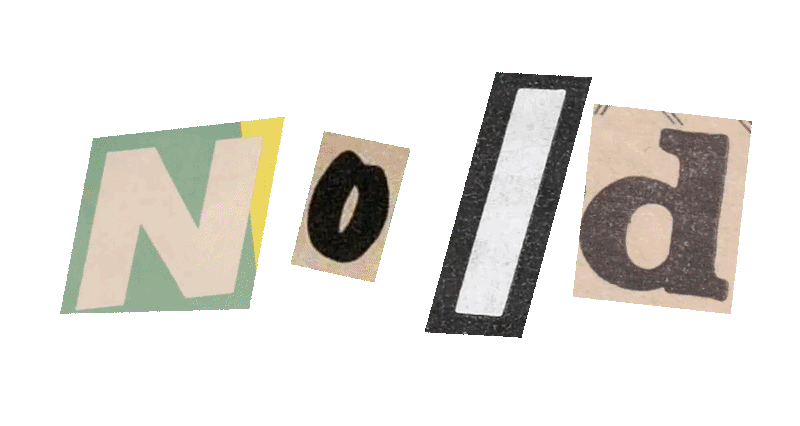
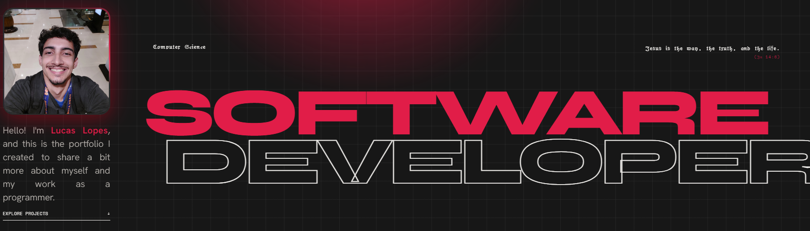

  

  # Portfolio — Lucas Lopes

  

    <b>Software Developer & Computer Science Student</b>
  

  

    
  

   

  

---

## About

Personal portfolio website built to showcase my projects, skills, and experience as a software developer. It features a fully responsive layout, dark/light theme switching, smooth animations, and optimized performance.

---

## Tech Stack

- React, JavaScript (ES6+), CSS3, Vite, Netlify

---

## Contact

- **Website:** [lucas-lopes.netlify.app](https://lucas-lopes.netlify.app/)
- **GitHub:** [@lucas1noid](https://github.com/lucas1noid)
- **LinkedIn:** [Lucas Lopes](https://www.linkedin.com/in/lucas-lopes-468a58309/)
- **Email:** [lucas1noid@gmail.com](mailto:lucas1noid@gmail.com)

---

  <small>Developed by Lucas Lopes · © 2026</small>

